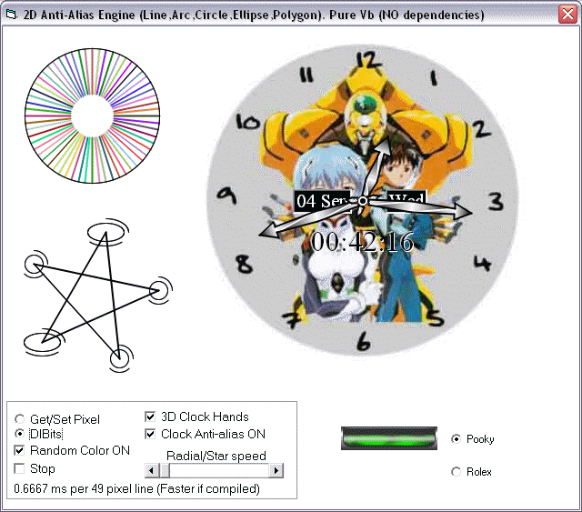



## Anti\-Alias 2D Engine \(Line,Arc,Circle,Ellipse,Polygon\)\. Pure Vb \(NO dependencies\)

### Description

2D Anti-Alias Engine *UPDATE* (Line,Arc,Circle,Ellipse,Polygon). Pure Vb (NO dependencies). Unlike most other engines this draws smooth objects without the jaggies. Superior quality of antialiased lines is achieved by adding a blended line to both sides of the original. 3D clock hands made with 2D rotating polygons and triangular gradient fills to simulate lighting/shading. All wrapped up in a simple to use class.
 
### More Info
 

             |
---                |---
**Submitted On**   |2002-09-03 23:53:44
**By**             |[Dana Seaman\_](https://github.com/Planet-Source-Code/PSCIndex/blob/master/ByAuthor/dana-seaman.md)
**Level**          |Intermediate
**User Rating**    |4.9 (151 globes from 31 users)
**Compatibility**  |VB 5\.0, VB 6\.0
**Category**       |[Graphics](https://github.com/Planet-Source-Code/PSCIndex/blob/master/ByCategory/graphics__1-46.md)
**World**          |[Visual Basic](https://github.com/Planet-Source-Code/PSCIndex/blob/master/ByWorld/visual-basic.md)
**Archive File**   |[Anti\-Alias126326932002\.zip](https://github.com/Planet-Source-Code/dana-seaman-anti-alias-2d-engine-line-arc-circle-ellipse-polygon-pure-vb-no-dependencies__1-38582/archive/master.zip)

### API Declarations

Many. See code

